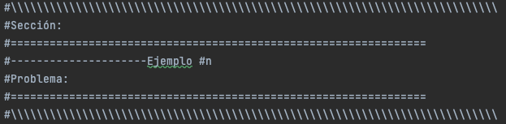

# Fundamentos de programacion con Ruby

This repository stores all the code developed in the text "Programming Fundamentals with Ruby."

The repository consists of 7 directories corresponding to each chapter of the text, each containing a .rb file that stores the codes worked on in that chapter.

The structure in which each .rb file is organized is as follows:

You will find the corresponding section and other specifications that allow for quick location within the reading.

## Contact information
If there are any issues with the code or the text, you can open issues on Github or contact via the following emails:

- mailto: miguel.lopez@utp.edu.co
